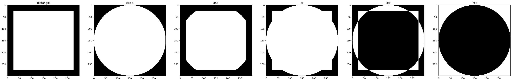
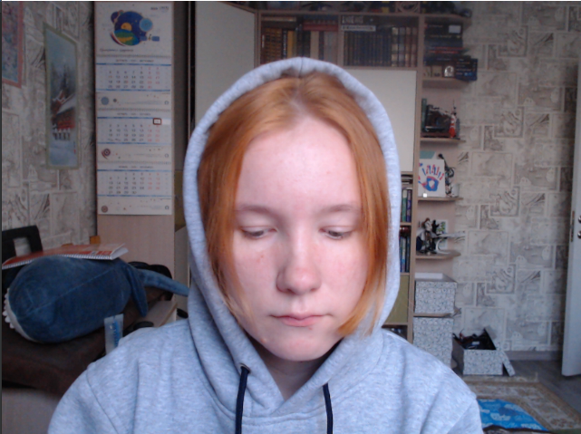
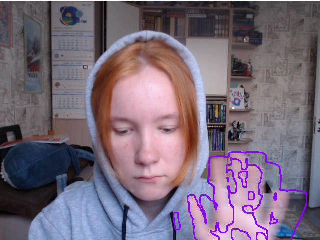

# ПЗ1
# Базовая обработка изображений

Команда:
Смолкина Анастасия Владимировна М3О-414Б-20
Цатурьян Константин Артурович М3О-414Б-20
Клочкова Анастасия М3О-412Б-20

Задания:

1. Создать фильтр для изображения

2. Создать детектор движения по камере ноута

### Задание 1

Было сделано ещё на паре в колабе: https://colab.research.google.com/drive/16GnNUcuWzBtDTKEWHnwgNe5_j92ywZzj?usp=sharing

### Задание 2

Для меня это был первый опыт программирования на Python.

Как работает программа:
1. Получает видео с камеры;
2. Создаёт два изображения из этого видео;
3. Ищет абсолютную разницу между двумя изображениями (XOR);

5. Применяет разные фильтры, чтобы перевести изображение РАЗНИЦЫ в чёрно белое и убрать шумы;
6. Ищет и рисует контуры;
7. Получает новое изображение и повторяет пп 2-6.

Выйти из программы можно нажав на <kbd>ESC</kbd>

Пример работы (нет движения/есть движение):

