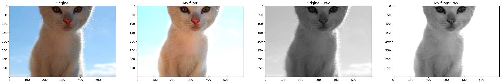
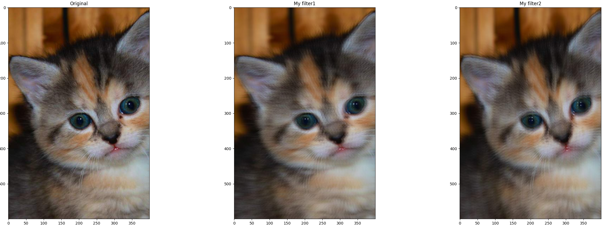
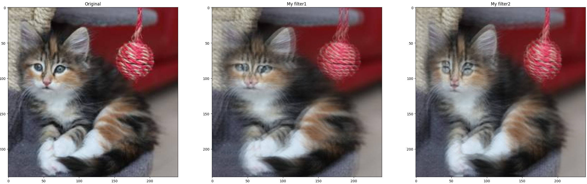
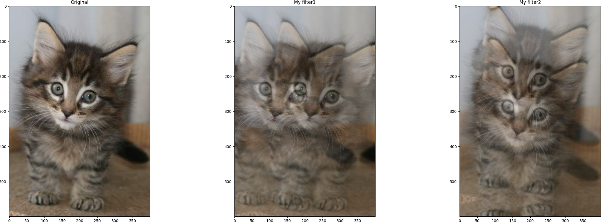
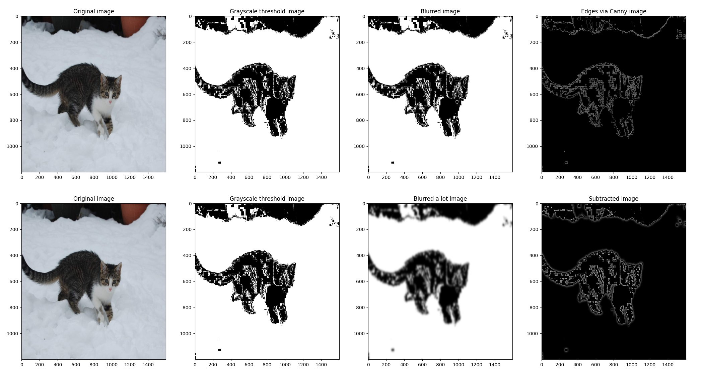
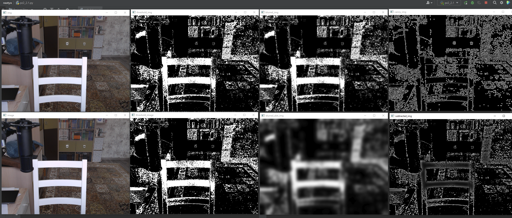

# ПЗ1
# Фильтры, цветовые гистаграммы, определение краев

Команда:

- Смолкина Анастасия Владимировна М3О-414Б-20

- Цатурьян Константин Артурович М3О-414Б-20

- Клочкова Анастасия Михайловна М3О-412Б-20

Задания:

1. Создать свой собственный фильтр через инициализацию матрицы

2. Написать алгоритм выделения границ контрастного объекта на изображении с использованием цветовой гистограммы и порога.

### Задание 1

Требования к заданию:
1. матрица не повторяет фильтр, представленные на занятии
2. вы продемонстрировали результат применения собственного фильтра в сравнении с реализованным в open cv
3. вы можете объяснить, какого эффекта добились и почему

Фильтр 1:

Ссылка на колаб: https://colab.research.google.com/drive/1yNtyO8VNqQpUKYv8vcueFeEg5PtiYYZ2?usp=sharing

В ходе эксперимента с матрицами мы выяснили, что если матрицу с единицей в середине умножить на коэфициент k, то будет меняться яркость изображения:

Фильтр 2:

Дальше мы решили поэкспериментировать с простыми матрицами и получили матрицу, которая при большом размере изображения просто "размывает" изображение:

Но при маленьком размере изображения эта матрица делает из одного котика двух (по горизонтали или по вертикали):

Чтобы добиться того же эффекта на большом изображении пришлось увеличить матрицу примерно в 10 раз и в итоге получился такой эффект:

Мы вывели формулу зависимости размера матрицы от размера изображения, в последней версии кода (сама нижняя плашка в колабе) матрица будет генерироваться сама в зависимости от выбранного размера.

Как работает: две единицы в матрице копируют кота в двух направлениях.

### Задание 2

Требования:
1. Переведите изображение в цветовое пространство HSV
2. Проанализируйте гистограмму изображения и выберите min, max пороговое значение, чтобы сегментировать контрастный объект.
3. Внедрите применение порога обработку, чтобы сегментировать контрастный объект.
4. Реализуйте обнаружение границ с помощью фильтра Кэнни. Примените фильтр Гаусса перед обнаружением границ. Оцените результат
5. Приметие алгортим выделения границ с помощью вычетания: взять изображение размыть его Гауссом с большой апертурой, например, 49, а потом вычесть
получившееся изображение из исходного. Должны выделится границы. Сравните с Canny.
6. Примените полученные алгорим к реальному видео с камеры. Проверьте его на реальном объекте

Пример работы (статичное фото котика/видео с камеры):

