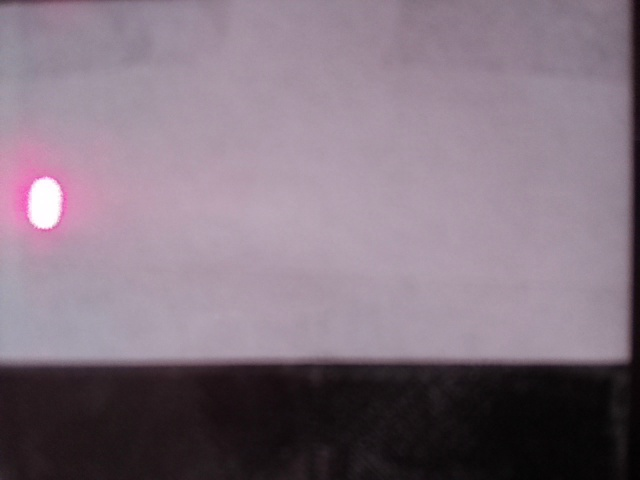
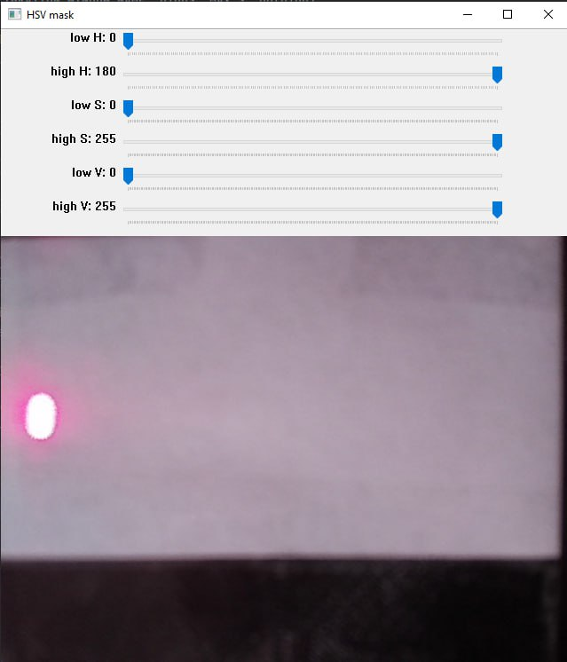
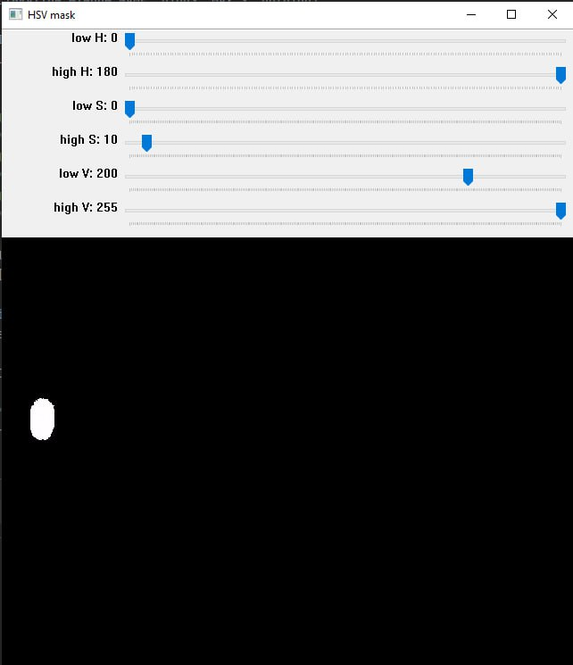
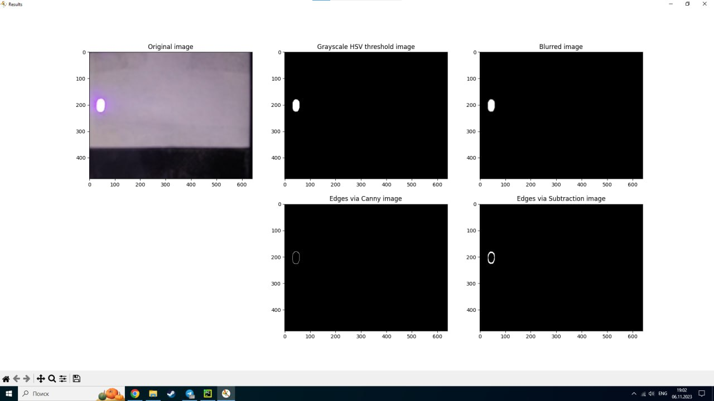

# ДЗ от 06.11
# Выделение цветового пятна

Команда:
- Смолкина Анастасия Владимировна М3О-414Б-20
- Цатурьян Константин Артурович М3О-414Б-20
- Клочкова Анастасия Михайловна М3О-412Б-20

### Задание
Придумать алгоритм выделения центра лазерного пятна.  

  
Программа основана на программе из ПЗ-2, где необходимо было при помощи гистограммы HSV изображения выделить объект на фото и его границы.
В качестве улучшения к предыдущей программе был добавлен блок кода (который можно вынести в отдельный скрипт), который выводит ползунки для настройки границ threshold`a для HSV изображения.
Таким образом, с помощью ползункоd можно получить оптимальное значение, которое будет использовано далее.
  
Изображение до применения маски (все значения по умолчанию):  

  
Изображение после применения маски:  

  
Таким образом, мы получаем яркое белое пятно, которое и является лазерным пятном. Далее его можно как угодно обрабатывать. Например, применить фильтр Canny или метод вычитания для выделения границ объекта (пятна) из прошлого практического задания. Получив границу (замкнутый контур) можно рассчитать его цент через моменты. Были получены следующие результаты:  

  
Можно видеть, что фильтр Canny дает четкие тонкие границы, в то время как метод вычитания дает более толстые границы, но тоже уместен в целях данной задачи.
